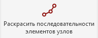

Плагин раскрашивает последовательности элементов узлов в цвета линий детализации, на основе которых созданы последовательности.

### Где находится

Плагин расположен на вкладке **GARDA_ВИС**, в панели **ЭОМ/СС/АК**.

{width=193px height=75px}

### Как пользоваться

1. Перейдите на план, разрез или другой 2D-вид с узлами.

2. Запустите плагин.

3. Выберите режим обработки:

   -  **Обработать выбранные последовательности узлов**;

      -  Перед запуском можно предварительно выделить элементы узлов.

         Если элементы не выделены, плагин предложит выбрать их вручную. Выбирать можно только элементы категории **«Элементы узлов»** на активном виде.

      -  Нажать «**Готово**»

   -  **Обработать все последовательности узлов на виде**.

      -  Плагин автоматически обрабатывает все элементы узлов, находящиеся на активном виде.

### **Результат**

Элементы узлов, относящиеся к одной цветной линии, отображаются соответствующим цветом.

<image src="./pokrasit-posledovatelnosti-elementov-uzlov-2.webp" crop="0,0,100,100" scale="644px" width="1077px" height="582px" float="center"/>

<note>

**Важные ограничения**

-  Плагин не работает в редакторе семейств.

-  Плагин не работает на 3D-видах.

-  Обрабатываются только элементы узлов активного вида.

-  Линии должны проходить через элементы с точностью до 5 мм.

-  Если подходящая линия не найдена, элемент пропускается.

-  Если найдены линии разных цветов, в массовом режиме элемент пропускается.

</note>