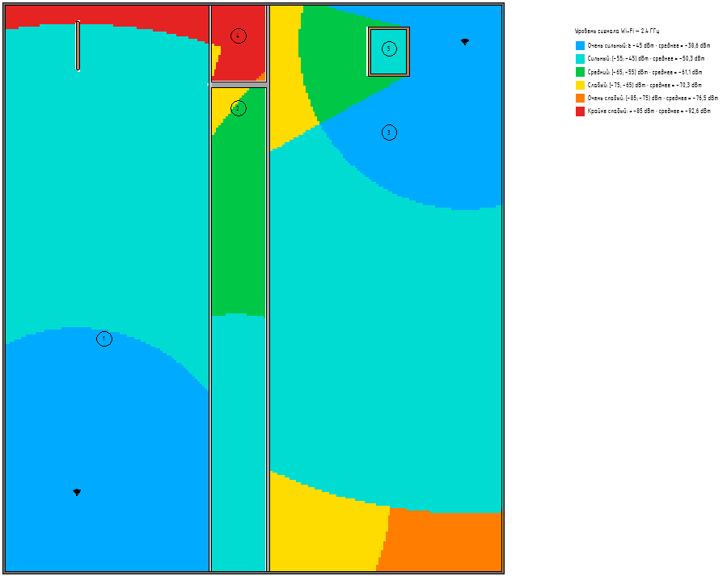

Плагин предназначен для построения на текущем виде тепловой карты предполагаемого покрытия Wi-Fi.

При расчёте учитываются:

-  расположение точек доступа;

-  мощность передатчика и усиление антенны;

-  Частотные диапазоны (2,4 или 5 ГГц)**;**

-  расстояние до точки доступа;

-  пересекаемые стены;

-  границы помещений основной модели и загруженных связей.

Результат -- **цветовые области на текущем виде** и, при размещении, легенда уровней сигнала.

<note type="info">

**Важно**

Карта зон покрытия предназначена для предварительной оценки размещения оборудования. Это не результат измерений и не замена специализированному радиопланированию или обследованию объекта.

</note>

### Где находится

Плагин расположен на вкладке **GARDA_ВИС**, в панели **ЭОМ/СС/АК**.

{width=96px height=74px}

### **Как пользоваться**

1. Откройте план нужного этажа;

2. Проверьте наличие размещённых помещений с ненулевой площадью в связанной модели АР;

3. Расставьте семейства точки доступа Wi-Fi **«Точка доступа WI-FI\_(У)\_ЧФ-Wi-Fi»** из библиотеки семейств;

4. Запустите плагин:

   -  После запуска доступны четыре команды.

   | **Команда**                               | **Действие**                                                                                                   |
   |-------------------------------------------|----------------------------------------------------------------------------------------------------------------|
   | **Обработать все точки доступа на виде**  | Построение карты по найденным точкам доступа текущего вида                                                     |
   | **Выбрать точки доступа**                 | Построение карты только по указанным пользователем экземплярам                                                 |
   | **Пересчитать все зоны покрытия на виде** | Перестроение карты по всем точкам доступа текущего вида, замена легенды с условными графическими обозначениями |
   | **Удалить зоны покрытия**                 | Удаление карты и её легенды с текущего вида                                                                    |

   -  При ручном выборе отметьте точки доступа и нажмите **«Готово»**.

5. Выберите детализацию

   | **Детализация** | **Размер ячейки** | **Когда использовать**                               |
   |-----------------|-------------------|------------------------------------------------------|
   | Высокая         | 100 × 100 мм      | Для небольшого участка или окончательного оформления |
   | Средняя         | 250 × 250 мм      | Для обычной проверки                                 |
   | Низкая          | 500 × 500 мм      | Для первого расчёта и больших планов                 |

6. Укажите место легенды, щёлкнув на свободном участке плана.

   <note type="info">

   При обычном построении можно нажать **Esc**, чтобы создать карту без легенды.

   </note>

Результат появляется на плане:

{width=899px height=713px}

### **Чтение результатов**

Чем ближе значение dBm к нулю, тем сильнее сигнал: **−45 dBm сильнее, чем −75 dBm**.

| **Цвет**  | **Расчётный уровень сигнала** |
|-----------|-------------------------------|
| Голубой   | ≥ −45 dBm                     |
| Бирюзовый | ≥ −55 и \< −45 dBm            |
| Зелёный   | ≥ −65 и \< −55 dBm            |
| Жёлтый    | ≥ −75 и \< −65 dBm            |
| Оранжевый | ≥ −85 и \< −75 dBm            |
| Красный   | \< −85 dBm                    |

Легенда дополнительно показывает среднее расчётное значение для каждого цветового диапазона, если в нём есть ячейки. Это среднее арифметическое значений в dBm.

### **Пересчёт**

После перемещения точек доступа, изменения их параметров или обновления архитектуры:

1. Откройте вид с картой.

2. Запустите плагин.

3. Выберите **«Пересчитать все зоны покрытия на виде»**.

4. Укажите детализацию.

5. Дождитесь результата.

Если старая легенда найдена, новая размещается на её прежнем месте. Если нет -- скрипт попросит указать место.

<note type="info">

При пересчёте нажатие Esc на запросе места новой легенды отменяет операцию без изменений.

</note>