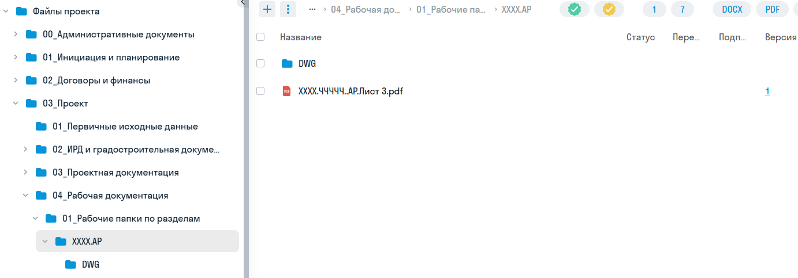
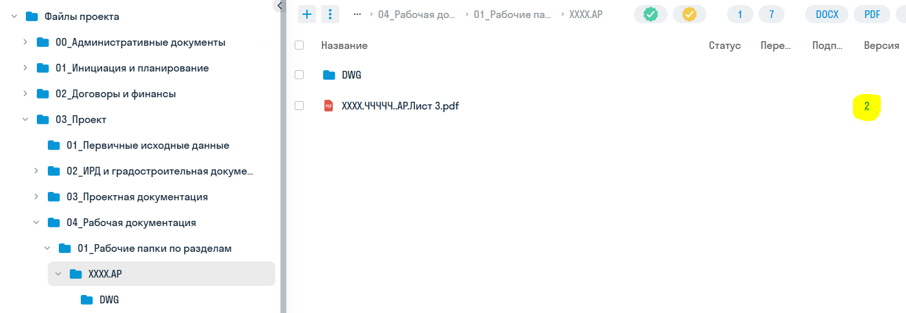

<note>

Корректная загрузка файлов на платформу предполагает использование перезапись старых файлов новыми. Создавать папки или файлы с префиксами с датами нельзя - теряется версионность.

</note>

Для того, чтобы загрузить файлы в целевую папку необходимо воспользоваться меню добавления **\+** и выбрать **загрузить файл** или **загрузить папку.** Альтернативно - «схватить» файл в проводнике и «сбросить» его в окне с целевой папкой как в Windows (drag-n-drop).

### Проектная и рабочая документация

Проектная документация находится в папке

**03_Проект/03_Проектная документация/01_Рабочие папки по разделам**

В папке требуется создать структуру папок по томам в соответствии с утверждённым составом документации. В каждой папке один файл .pdf содержит один **том** документации.

Рабочая документация находится в папке

**03_Проект/04_Рабочая документация/01_Рабочие папки по разделам**

В папке требуется создать структуру папок по томам в соответствии с утверждённым составом документации. В каждой папке один файл .pdf содержит один **лист** документации.

Файлы в редактируемом формате должны быть размещены во вложенной папке **DWG.**

<note type="danger">

Загружать том рабочей документации одним файлом запрещено!

</note>

### 

### Пример загрузки листа рабочей документации.

В проекте рабочая документация хранится в папке 03_Проект/04_Рабочая документация/01_Рабочие папки по разделам.

Если в папке отсутствует папка с нужной маркой - следует её создать с наименованием по принятому шифру для марки. Если для марки есть несколько книг или томов - требуется создать подпапки по книгам или томам.

В целевой папке должны находиться листы документации в формате .pdf, если выгружается редактируемый формат, то создаётся папка DWG - в которую кладутся все файлы редактируемого формата: .dwg, .xls, .txt, .doc и прочие.

<note type="danger">

Временные .bak файлы и мусорные файлы логирования .plot .log подгружать запрещено.

</note>

Пример на скриншоте:

{width=1382px height=483px}

Если была подготовлена версия новее, то она загружается поверх предыдущего файла. Файлы должны иметь полностью совпадающие имена.

{width=1402px height=486px}

Файл подгружен новый - версия файла поменялась. При нажатии на число в столбце «версия» открывается окно с историей версий, где можно посмотреть всю историю версий.

{width=445px height=190px}

<note>

Если по какой-то причине потребовалось изменить шифр или наименование файла или номер листа - при замене файла нужно сначала переименовать старый файл на портале и только после этого подгружать поверх новый - иначе не будет контроля версий.

</note>