Для того, чтобы создать процесс согласования документации необходимо определить тип комплекта документации к согласованию и подходящий маршрут.

В таблице ниже представлены шесть типов согласований. Раздел **АР** принят в иллюстративных целях - у каждого из участников проектирования раздел свой.

У **ГИП** есть возможность построить независимый маршрут согласования, где согласующим является только сотрудник с ролью **ГИП**.

<table header="row">
<colgroup><col width="98"/><col width="98"/><col width="278"/><col width="220"/><col width="589"/><col width="198"/><col width="173"/><col width="125"/></colgroup>
<tr>
<td>

Шифр комплекта согласования

</td>
<td>

Группа согласований

</td>
<td>

Тип комплекта

</td>
<td>

Наименование комплекта согласования

</td>
<td>

Описание комлекта

</td>
<td>

Тип согласования (выбор маршрута в сигнал)

</td>
<td>

Инициатор и согласующий 1 этапа

</td>
<td>

Согласующий 2 этапа

</td>
</tr>
<tr>
<td>

ПД_АР

</td>
<td>

АР

</td>
<td>

Проектная документация и концепция

</td>
<td>

АР_Проектная документация и концепция

</td>
<td>

Листы или части документации, разработанные на стадии проект и ранее, согласованные с заказчиком и со смежными разделами.

Каждый том - отдельный файл pdf.

</td>
<td>

Согласование альбома ПД АР

</td>
<td>

Ответственный АР

</td>
<td>

ГИП

</td>
</tr>
<tr>
<td>

РД_АР

</td>
<td>

АР

</td>
<td>

Рабочая документация

</td>
<td>

АР_Рабочая документация

</td>
<td>

Листы, разработанные в рамках рабочей документации, согласованные с заказчиком и со смежными разделами. Данные листы могут быть направлены в работу отделом ПТО, после дополнительного согласования. Каждый лист - отдельный файл.

Комплект дополняется разработанными листами.

</td>
<td>

Согласование альбома РД АР - QR код

</td>
<td>

Ответственный АР

</td>
<td>

ГИП

</td>
</tr>
<tr>
<td>

ТР_АР

</td>
<td>

АР

</td>
<td>

Отдельные листы, узлы и технические решения

</td>
<td>

АР_Отдельные листы, узлы и технические решения

</td>
<td>

Листы, разработанные в рамках отдельных задач или с целью ознакомления, расчёта стоимости, тендера или закупки. Статус данных листов отслеживается "вручную" - после потери актуальности согласование отдельных листов аннулируется.

Могут быть созданы отдельные дополнительные комплекты для конкретной цели.

</td>
<td>

Согласование листа РД АР - QR код

</td>
<td>

Ответственный АР

</td>
<td>

ГИП

</td>
</tr>
<tr>
<td>

ПД_ГИП

</td>
<td>

ГИП

</td>
<td>

Проектная документация и концепция

</td>
<td>

ГИП_Проектная документация и концепция

</td>
<td>

Данная документация проходит согласование только ГИПом - применяется для случаев, когда нет других участников согласования, например, при согласовании комплекта от подрядчиков.

</td>
<td>

Согласование альбома ПД

</td>
<td>

ГИП

</td>
<td>

ГИП

</td>
</tr>
<tr>
<td>

РД_ГИП

</td>
<td>

ГИП

</td>
<td>

Рабочая документация

</td>
<td>

ГИП_Рабочая документация

</td>
<td>

Данная документация проходит согласование только ГИПом - применяется для случаев, когда нет других участников согласования, например, при согласовании комплекта от подрядчиков.

</td>
<td>

Согласование альбома РД - QR код

</td>
<td>

ГИП

</td>
<td>

ГИП

</td>
</tr>
<tr>
<td>

ТР_ГИП

</td>
<td>

ГИП

</td>
<td>

Отдельные листы, узлы и технические решения

</td>
<td>

ГИП_Отдельные листы, узлы и технические решения

</td>
<td>

Данная документация проходит согласование только ГИПом - применяется для случаев, когда нет других участников согласования, например, при согласовании комплекта от подрядчиков.

</td>
<td>

Согласование листа РД - QR код

</td>
<td>

ГИП

</td>
<td>

ГИП

</td>
</tr>
</table>

### Пример создания нового согласования на примере листов альбома АР РД.

В рассматриваемом примере требуется отправить на согласование два листа рабочей документации:

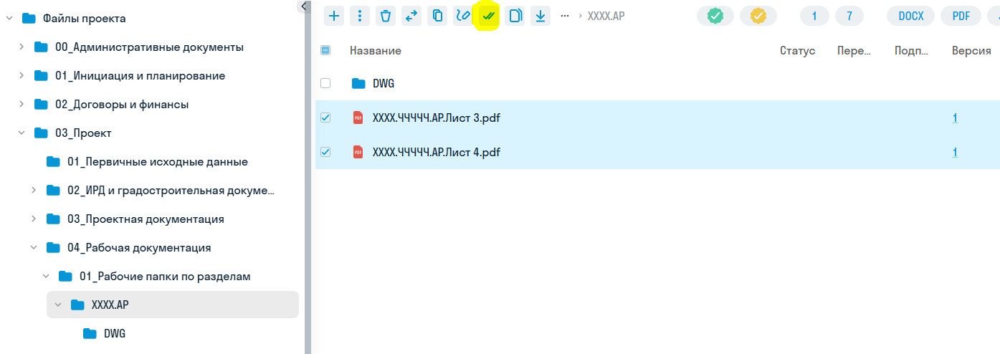{width=1395px height=494px}

Для этого требуется выбрать нужные файлы и в меню найти кнопку «добавить в согласования»

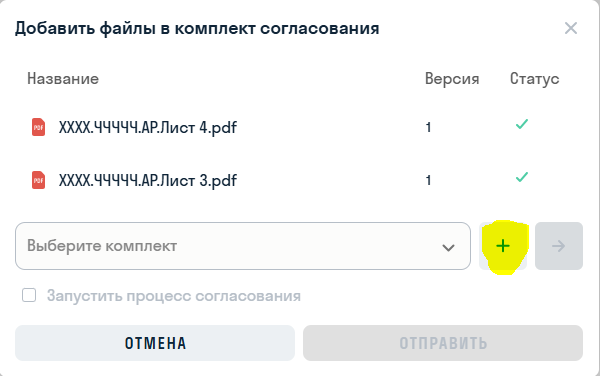{width=600px height=376px}

Нажатием на + создаём комплект согласования по таблице выше.

В примере инициатор и первый согласующий - ответственный за раздел архитектор, стадия работы РД, документация разработана для передачи в монтаж (в разработанном объёме) в рамках тома АР.

Шифр комплекта **РД_АР**, наименование комплекта **АР_Рабочая документация**, тип согласования (маршрут) - **согласование альбома РД АР - QR код**:

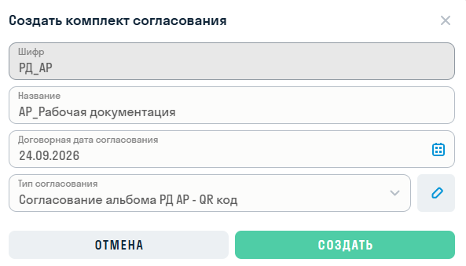{width=593px height=339px}

После создания комплекта он автоматически выбирается в текущее согласование. Для немедленного старта нужно нажать галочку **Запустить процесс согласования**:

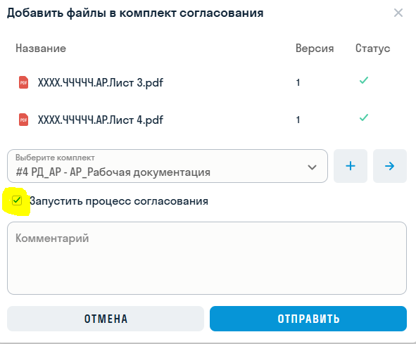{width=591px height=489px}

Далее необходимо перейти во вкладку **Согласования** в шапке страницы, где собран перечень всех созданных согласований.

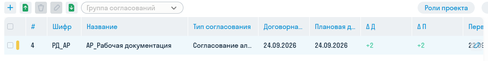{width=1144px height=143px}

При нажатии на нужно согласование переходим в подробную страницу по выбранному согласованию:

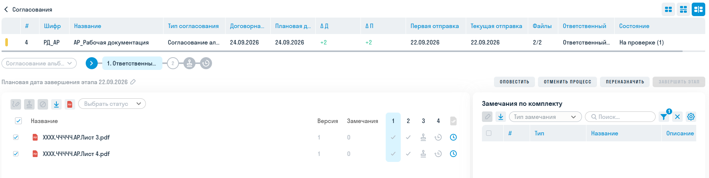{width=1886px height=476px}

Для согласований файлов необходимо для каждого файла на каждом этапе нажать галочку **утверждения** и выбрать нужный статус (утверждено/ согласовано с замечаниями/ отклонено)

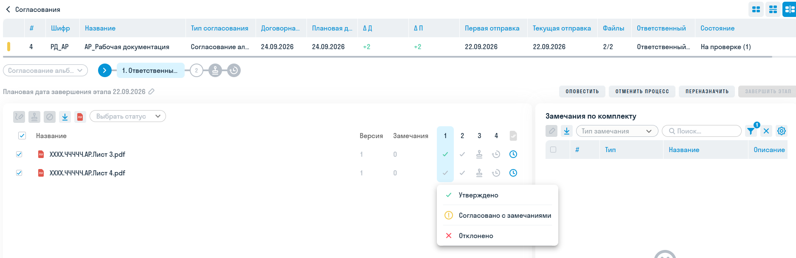{width=1875px height=609px}

После выбора статусов нужно нажать кнопку завершения этапа:

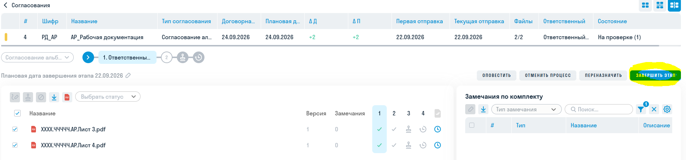{width=1889px height=441px}

По завершению всех этапов согласования у нас есть возможность проверить статусы и авторов согласования:

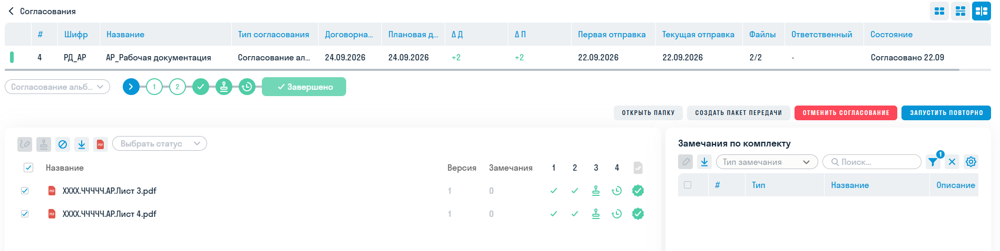{width=1898px height=478px}

Все согласованные файлы автоматически переносятся в папку **03_Проект/05_Разработанная документация/02_Утверждена**

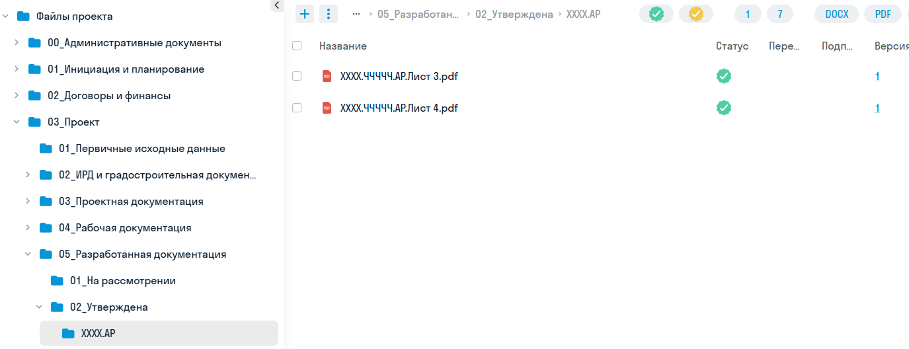{width=1375px height=528px}

### Пример создания согласования при замене версии файла.

В рассматриваемом примере заменим лист 3 на новую версию.

В папке **03/04/01** находятся два файла - с разным статусом.

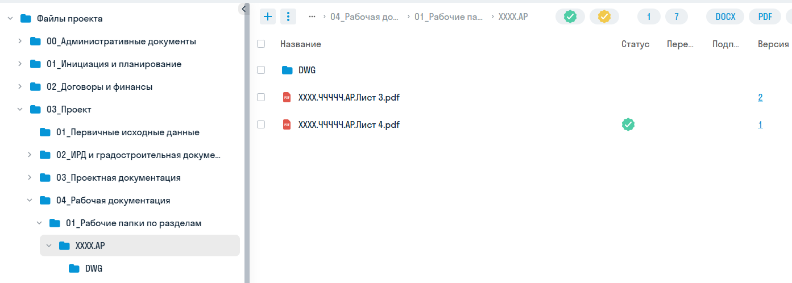{width=1393px height=498px}

Листы 3 и 4 были согласованы в 1 версии, но лист 3 заменён и его статус на текущий момент неизвестен. В столбце версий мы видим что у листа 3 версии файлов было две.

При этом в папке с утверждённой документацией **03/05/02** мы видим только согласованные версии - лист 3 в этой папке был только в одной версии.

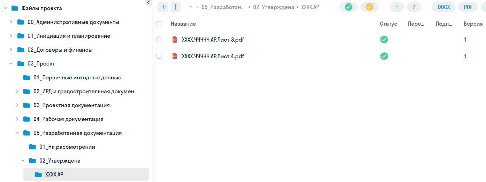{width=1394px height=525px}

При загрузке в рабочую папку файла новой версии существующие согласования не отменяются - для этого необходимо запустить согласование заново для актуализации версии. Для этого необходимо перейти во вкладку **Согласования** в шапке страницы,

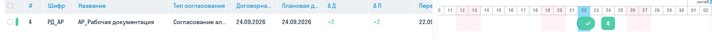{width=1871px height=108px}

найти нужный комплект согласования и открыть его. На подробной странице мы увидим что у листа 3 есть новая версия- восклицательный знак рядом с номером версии.

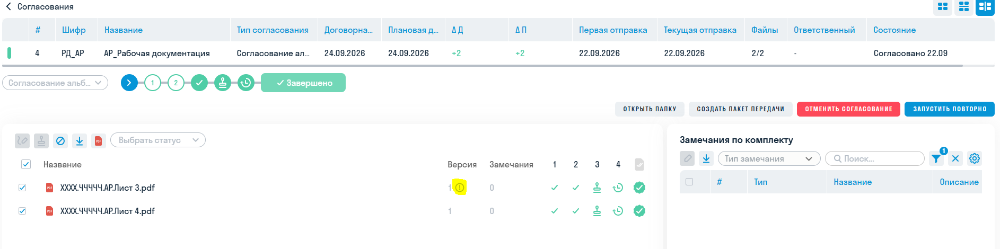{width=1886px height=470px}

Справа нажимаем кнопку «запустить повторно» и выбираем сценарий запуска «запуск изменений» - так мы пересогласуем только те файлы, версии которых менялись.

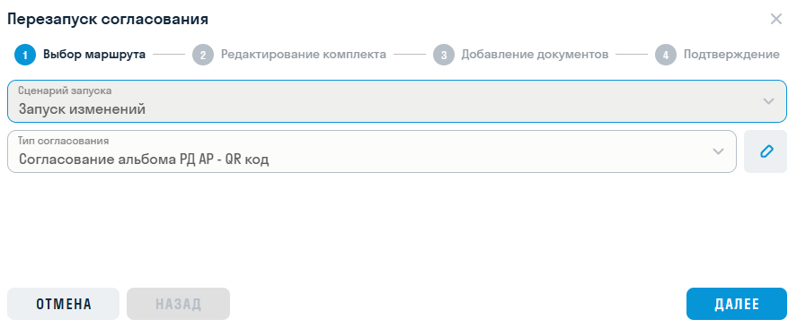{width=887px height=366px}

Жмём далее - далее и на третьем шаге «Добавление документов» видим что третий лист будет заменён на новую версию из рабочей папки:

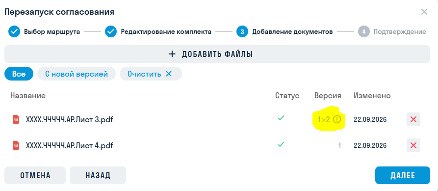{width=893px height=389px}

<note type="tip">

Если случайно убрали из комплекта согласований лист документации или нужный лист отсутствует - нужно воспользоваться меню «+ добавить файлы» для их добавления.

</note>

Оставляем файлы только с новой версией:

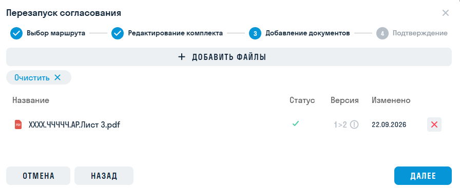{width=896px height=367px}

<note>

Если файл добавлен вручную, то восклицательный знак у версии будет отсутствовать.

</note>

Жмём далее - создать и автоматически возвращаемся в подробное меню согласования с новым запуском

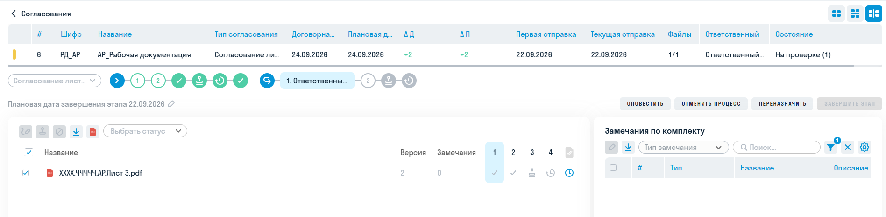{width=1897px height=466px}

<note>

На этом этапе старые листы и согласования ещё актуальны - если нажать на зелёную галочку, то можно увидеть весь прошлый согласованный комплект:

</note>

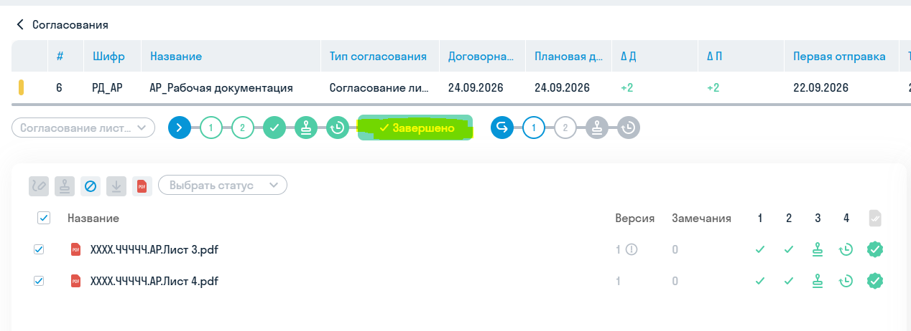{width=1268px height=462px}

После проведение второго согласования возвращаемся в подробное меню и видим всю историю согласований - было два процесса, оба завершились согласованием:

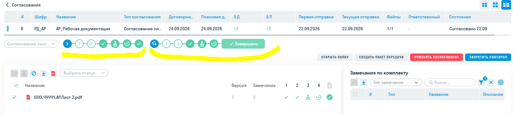{width=1894px height=426px}

На этом этапе если мы нажмём на завершение прошлого процесса то мы увидим, что старая версия листа 3 аннулирована.

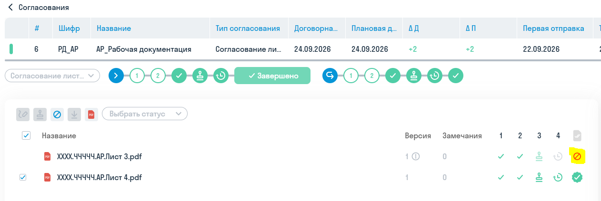{width=1262px height=423px}

В папке с утверждённой документацией мы видим два согласованных файла, где у листа 3 есть две версии.

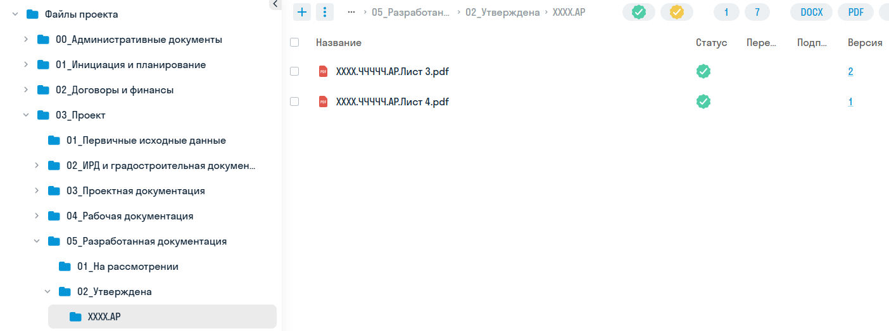{width=1404px height=525px}

Если мы нажмём на число 2 в столбце Версия то увидим историю версий и их статусы согласования:

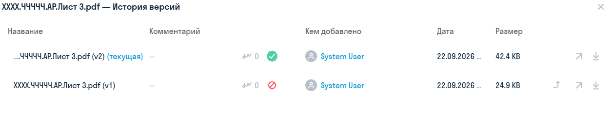{width=1257px height=252px}

### Пример добавления нового файла в комплект согласования

В рассматриваемом примере в папку **03/04/01** загружен лист 2, который ранее отсутствовал:

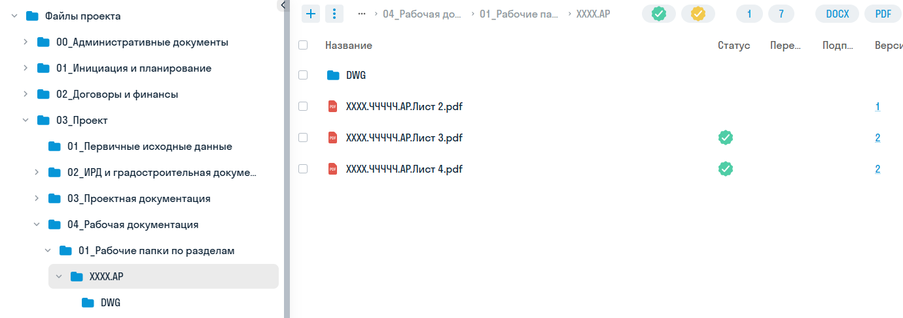{width=1380px height=488px}

Для его добавления в комплект согласования переходим во вкладку **Согласования**, находим нужный комплект, открываем подробный вид согласования и жмём кнопку запустить повторно. Выбираем сценарий **дополнительное согласование**, на шаге Добавление документов через меню ищем новый файл в целевой папке и выбираем его в комплект и запускаем согласование.

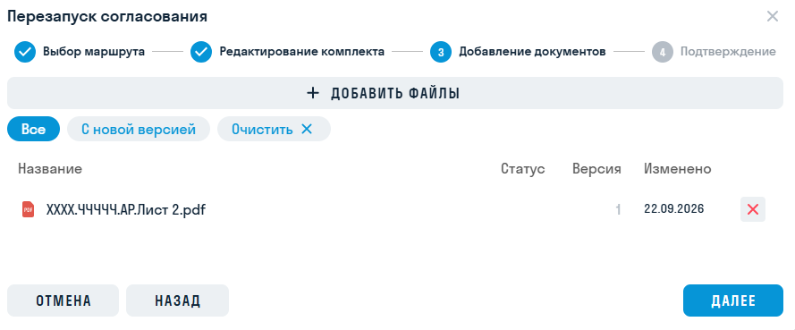{width=889px height=369px}

### Как проверить текущие статусы согласований документации

В рабочей папке по разделам **03/04/01**:

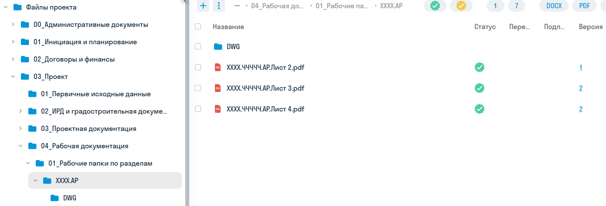{width=1390px height=475px}

У каждого файла указан статус согласования. Необходимо проверить статусы согласований версий:

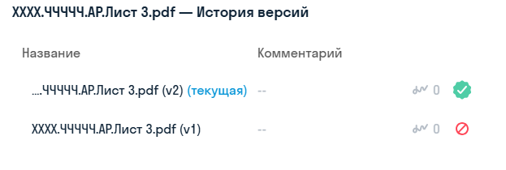{width=623px height=210px}

<note type="danger">

Со статусом согласован должна быть только одна версия. Если согласованы две версии и более- процессы согласования были созданы неверно.

</note>

В папке с утверждённой документацией **03/05/02**:

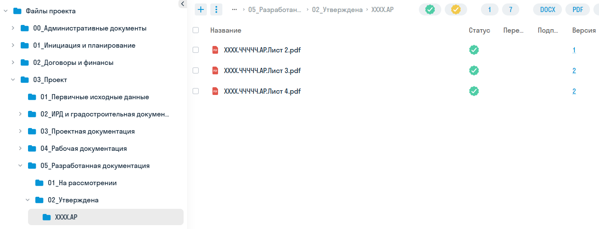{width=1390px height=533px}

Аналогично, у каждого файла есть версия со статусом:

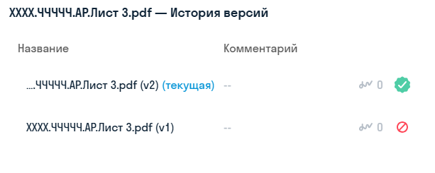{width=613px height=245px}

<note>

Важное уточнение - в рассматриваемых папках лежат **не одинаковые** файлы - в рабочих папках файлы остаются в исходном виде, в папке с утверждённой документацией (для маршрутов с QR кодом) файлы содержат QR код.

</note>

<note>

Второе важное уточнение - версии в папках отсчитываются только для файла применительно к этой папке - если скопировать или загрузить файл с таким же названием в другую папку - он будет в первой версии, поэтому если требуется переместить файл - необходимо пользоваться именно функцией перемещения, тогда версионность и ссылки на файл сохранятся.

</note>

<note>

Третье важное уточнение - версии файлов в рабочей папке и в папке с утверждённой документацией для одинаковых могут не совпадать по различным причинам. Рассмотрим их отдельным блоком.

</note>

### Возможные ошибки при согласованиях

*В разработке*